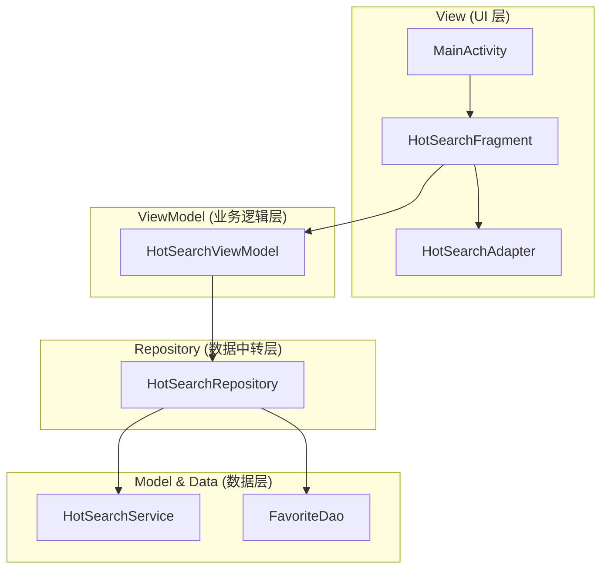

# 🚀 今日热搜 App：从零到一代码学习指南

> **写给零基础的你**：本指南旨在通过“傻瓜式”步骤，带你从阅读环境搭建开始，逐步深入理解“今日热搜” App 的核心架构与实现。

---

## 📖 目录
1. [🛠 环境准备：第一步怎么走](#1-环境准备第一步怎么走)
2. [🧭 全景速览：系统长什么样](#2-全景速览系统长什么样)
3. [🧩 分模块精读：核心代码拆解](#3-分模块精读核心代码拆解)
    - [Model 层：数据长什么样](#model-层数据长什么样)
    - [API & DB 层：数据从哪来](#api--db-层数据从哪来)
    - [Repository 层：数据中转站](#repository-层数据中转站)
    - [ViewModel 层：大脑核心](#viewmodel-层大脑核心)
    - [UI 层：眼睛看到的](#ui-层眼睛看到的)
4. [🛤 学习路径：三阶段进阶方案](#4-学习路径三阶段进阶方案)
5. [🛠 配套任务：动手练一练](#5-配套任务动手练一练)
6. [📚 资源索引：遇到问题看这里](#6-资源索引遇到问题看这里)
7. [🔬 性能监控与调试：发现内存泄漏与 ANR](#7-性能监控与调试发现内存泄漏与-anr)
8. [💡 进阶话题：应用间通信 (分享功能)](#8-进阶话题应用间通信-分享功能)

---

## 1. 🛠 环境准备：第一步怎么走

## 1. 🛠 环境准备：第一步怎么走

### 1.1 阅读环境搭建
1.  **安装 IDE**: 
    - 下载并安装 [Android Studio (Ladybug 或更高版本)](https://developer.android.com/studio)。
    - **傻瓜提示**: 它是 Google 官方提供的“代码编辑器”，就像写文档用的 Word。
2.  **克隆项目**:
    - 在 Android Studio 欢迎界面点击 `Get from VCS`，输入项目仓库地址：`https://github.com/example/hotsearch.git`。
3.  **依赖安装 (Gradle Sync)**:
    - 打开项目后，右下角会出现一个“加载条”。
    - **操作点**: 点击右上角的大象图标 `Sync Project with Gradle Files`。等待加载完成，直到没有报错。

### 1.2 第一次打开代码该点什么？
当你看到左侧一堆文件夹时，按以下顺序“点一点”：
1.  **入口 Activity**: 点击 [MainActivity.java](file:///c:/Users/Lenovo/HotSearch/app/src/main/java/com/example/hotsearch/ui/MainActivity.java)。它是 App 启动后的第一个“大管家”。
2.  **首页布局**: 点击 [fragment_hot_search.xml](file:///c:/Users/Lenovo/HotSearch/app/src/main/res/layout/fragment_hot_search.xml)。你会看到 App 首页的静态样子。
3.  **网络配置**: 点击 [HotSearchService.java](file:///c:/Users/Lenovo/HotSearch/app/src/main/java/com/example/hotsearch/api/HotSearchService.java)。这是 App 获取全网热点的“天线”。

---

## 2. 🧭 全景速览：系统长什么样

### 📢 30秒电梯演讲
> “今日热搜”是一款聚合类 Android 应用。它像一个**数据搬运工**：通过 **Retrofit** 从 **uapis.cn** 抓取微博、知乎等平台的热搜，利用 **MVVM 架构** 把杂乱的数据整理好，最后优雅地呈现在 **RecyclerView** 列表中。如果你看到感兴趣的话题，还可以一键收藏到本地的 **Room 数据库** 中。

### 🏗 架构图 (Mermaid)
<details>
<summary>点击展开架构图代码 (Mermaid 原稿在 ARCHITECTURE_DIAGRAM.mermaid)</summary>


</details>

---

## 3. 🧩 分模块精读：核心代码拆解

### Model 层：数据长什么样
- **定位路径**: [com.example.hotsearch.model](file:///c:/Users/Lenovo/HotSearch/app/src/main/java/com/example/hotsearch/model/)
- **核心职责**: 定义 App 中所有数据的“模子”。
- **关键类**: [HotSearchItem.java](file:///c:/Users/Lenovo/HotSearch/app/src/main/java/com/example/hotsearch/model/HotSearchItem.java) (定义一个热搜项包含：标题、链接、热度)。
- **数据流**: API 返回的 JSON -> 经过 Gson 转换 -> 变成 HotSearchItem 对象。
- **改动场景**: 比如想增加一个“来源平台”字段，就在这里改。

### API & DB 层：数据从哪来
- **定位路径**: [api](file:///c:/Users/Lenovo/HotSearch/app/src/main/java/com/example/hotsearch/api/) & [db](file:///c:/Users/Lenovo/HotSearch/app/src/main/java/com/example/hotsearch/db/)
- **核心职责**: 负责从互联网或本地磁盘拿数据。
- **关键类**: [HotSearchService.java](file:///c:/Users/Lenovo/HotSearch/app/src/main/java/com/example/hotsearch/api/HotSearchService.java) (网络天线)。
- **环境变量**: [HotSearchRepository.java](file:///c:/Users/Lenovo/HotSearch/app/src/main/java/com/example/hotsearch/repository/HotSearchRepository.java) 中的 `API_KEY`。

### 🚀 最小可运行 Trace (跟跑一次)
**场景**: 用户下拉刷新首页。
1.  **入口**: [HotSearchFragment.java:L106](file:///c:/Users/Lenovo/HotSearch/app/src/main/java/com/example/hotsearch/ui/fragment/HotSearchFragment.java) (点击刷新)。
2.  **调用大脑**: 触发 `viewModel.refresh()`。
3.  **请求仓库**: 仓库 `repository.getHotSearch(platform)`。
4.  **发起网络请求**: `service.getHotSearch(platform, key)`。
5.  **数据流回**: 仓库收到响应 -> 封装成 `Resource.success()` -> 发给 ViewModel。
6.  **UI 响应**: ViewModel 更新 LiveData -> Fragment 观察到变化 -> `adapter.submitList()` 刷新列表。

---

## 4. 🛤 学习路径：三阶段进阶方案

| 阶段 | 路线名称 | 里程碑 | 预计耗时 | 检验标准 |
| :--- | :--- | :--- | :--- | :--- |
| **P1** | **只读业务** | 看懂数据怎么显示在屏幕上 | 3h | 能回答：点击收藏按钮，数据经过了哪些类？ |
| **P2** | **能改配置** | 修改平台列表，调整 UI 颜色 | 5h | 能完成：在首页 Tab 栏新增一个“腾讯新闻”选项。 |
| **P3** | **能写逻辑** | 实现一个简单的本地搜索功能 | 10h | 能完成：在收藏页增加一个搜索框，过滤本地收藏。 |

---

## 5. 🛠 配套任务：动手练一练

### 任务 1：修改 App 标题 ⭐
- **阅读**: [strings.xml](file:///c:/Users/Lenovo/HotSearch/app/src/main/res/values/strings.xml)
- **改动**: 将 `main_title` 从“今日热榜”改为“我的热搜榜”。
- **验证**: 运行 App，检查首页顶部文字。

### 任务 2：调整下拉刷新颜色 ⭐⭐
- **阅读**: [HotSearchFragment.java](file:///c:/Users/Lenovo/HotSearch/app/src/main/java/com/example/hotsearch/ui/fragment/HotSearchFragment.java)
- **改动**: 在布局文件中为 `platform_tabs` 增加 `app:tabIndicatorColor="@color/teal_700"`。
- **验证**: 点击不同的 Tab，看指示条颜色是否改变。

---

## 6. 📚 资源索引：遇到问题看这里

| 资源名称 | 适用阶段 | 推荐理由 | 链接 |
| :--- | :--- | :--- | :--- |
| **Retrofit 官方文档** | P2 | 学习如何修改网络请求接口 | [官网](https://square.github.io/retrofit/) |
| **Room 数据库指南** | P3 | 学习如何新增数据库字段 | [开发者官网](https://developer.android.com/training/data-storage/room) |
| **MVVM 模式详解** | P1 | 核心架构扫盲必读 | [文章](https://juejin.cn/post/6844903603417382925) |

---

## ⚠️ 新手易踩坑点 (Pitfalls)
1.  **线程模型**: **不要在主线程发网络请求**！你会看到 App 闪退。我们使用了 `AppExecutors` 专门处理这些耗时操作。
2.  **权限**: 忘记在 `AndroidManifest.xml` 加 `INTERNET` 权限会导致网络永远请求不到数据。
3.  **Context 泄露**: 在 Fragment 中使用 `requireContext()` 时，注意在 `onDestroyView` 中释放相关资源。

---

## 7. 🔬 性能监控与调试：发现内存泄漏与 ANR

> **目的**: 学会使用专业工具，像侦探一样找出导致 App 变慢、变卡的“元凶”。

#### 7.1 内存泄漏检测 (Memory Leak Detection)

**一句话解释**: 内存泄漏就像一个“健忘”的管家，用完东西（内存）后忘记归还，导致可用空间越来越少，最终让 App 因内存耗尽而崩溃 (OOM - Out of Memory)。

**核心工具：Android Studio Profiler**

这是 IDE 自带的强大工具，无需任何代码改动即可使用。

- **傻瓜式步骤**:
    1.  **启动 Profiler**: 运行 App 后，点击 Android Studio 底部工具栏的 `Profiler` 标签页。
    2.  **选择内存分析**: 在 Profiler 窗口中，点击 `Memory` 时间线。
    3.  **模拟用户操作**: 反复执行一个完整的用户流程，例如：
        - 从“首页”进入“收藏页”，再返回“首页”。
        - 重复此操作 5-10 次。
    4.  **强制垃圾回收 (GC)**: 在 Memory Profiler 工具栏中，点击垃圾桶图标（`Force garbage collection`）。
    5.  **观察内存曲线**: 如果每次返回首页并强制 GC 后，内存占用依然持续走高，无法回落到初始水平，那么几乎可以断定发生了内存泄漏。此时 `FavoriteFragment` 或其关联的 `ViewModel` 可能没有被正确释放。

**进阶工具 (推荐): LeakCanary**

- **它是什么**: 一个“内存泄漏自动报警器”。你只需要在项目中集成它（通常只是一行依赖代码），当它在运行时检测到内存泄漏，就会自动在手机上弹出一个通知，并生成详细的泄漏分析报告，精准告诉你哪个对象泄漏了，以及导致泄漏的引用链是什么。
- **实现思路 (未来)**: 在 `app/build.gradle.kts` 的 `dependencies` 中为 `debugImplementation` 添加 LeakCanary 的库依赖即可。

#### 7.2 ANR 预防与日志分析 (ANR Prevention & Log Analysis)

**一句话解释**: ANR (Application Not Responding) 指的是“应用无响应”。当你在 App 的主线程（UI 线程）上执行一个耗时操作（通常超过 5 秒），导致界面无法响应用户点击、滑动等交互时，系统就会弹出这个恼人的对话框。

**核心原则**: **绝不在主线程做耗时操作**。本项目中的 `AppExecutors` 就是为了将数据库读写、网络请求等任务切换到后台线程，这是预防 ANR 的根本。

#### 7.3 结构化日志库：使用 Logger (Advanced Logging)

**一句话解释**: 比原生 `Log` 更漂亮、更强大的日志工具。它能自动格式化 JSON、显示线程信息和方法调用栈，让调试变得赏心悦目。

**集成步骤**:
1.  **添加依赖**: 在 `libs.versions.toml` 中定义 `logger = "2.2.0"`，并在 `app/build.gradle.kts` 中引用。
2.  **全局初始化**: 在 [MainApplication.java](file:///c:/Users/Lenovo/HotSearch/app/src/main/java/com/example/hotsearch/MainApplication.java) 中进行配置：
    ```java
    FormatStrategy formatStrategy = PrettyFormatStrategy.newBuilder()
            .showThreadInfo(true)  // 显示线程信息
            .tag("HOT_SEARCH")      // 全局 Tag
            .build();
    Logger.addLogAdapter(new AndroidLogAdapter(formatStrategy));
    ```

**使用方法**:
- **普通打印**: `Logger.d("调试信息");`
- **格式化打印**: `Logger.i("获取成功! 平台: %s, 耗时: %dms", platform, duration);`
- **异常打印**: `Logger.e(throwable, "发生错误");`

**为什么用它？**
- **可视化**: 自动加边框，区分不同层级的调用。
- **易读性**: 自动识别并美化 JSON 字符串。
- **信息全**: 一眼看出日志是在哪个线程、哪个方法的哪一行打印的。

**日志分析策略 (Logcat)**

通过在关键路径打印耗时日志，我们可以量化每个操作的时间开销，提前发现潜在的性能瓶颈。

- **傻瓜式步骤**:
    1.  **选定监控点**: 选择你关心的耗时操作，例如 `HotSearchRepository` 中的 `getHotSearch` 网络请求。
    2.  **植入日志 (伪代码)**: 在该方法的开始和结束位置，记录时间戳并打印差值。
        ```java
        // HotSearchRepository.java
        public LiveData<Resource<List<HotSearchItem>>> getHotSearch(String platform) {
            Log.d("Performance", "开始请求热搜: " + platform);
            long startTime = System.currentTimeMillis();
            
            // ... (service.getHotSearch(...).enqueue(...)) ...
            
            // 在 Retrofit 的 onResponse 和 onFailure 回调中
            long duration = System.currentTimeMillis() - startTime;
            Log.i("Performance", "平台[" + platform + "]请求结束，耗时: " + duration + "ms");
        }
        ```
    3.  **分析日志**:
        - 打开 Android Studio 底部的 `Logcat` 标签页。
        - 在右上角的搜索框中输入 `Performance` 来过滤我们自己的性能日志。
        - 反复操作 App，观察每次请求的耗时。如果某个平台的请求耗时经常超过 1-2 秒，那就说明这个接口存在性能问题，需要进行优化（例如增加缓存、优化后端等）。

**核心工具：Android Studio CPU Profiler**

- **它能做什么**: 它可以像录像一样，记录下在你操作 App 期间，所有方法的执行时长和调用关系，帮你精准定位哪个函数是“慢动作”的元凶。
- **使用场景**: 当你感觉 App 的某个操作（如启动、页面切换）明显卡顿时，就可以使用 CPU Profiler。通过分析主线程的“火焰图”，可以清晰地看到是哪个方法占用了大量时间，从而导致了界面卡顿甚至 ANR。

---

## 8. 💡 进阶话题：应用间通信 (分享功能)

> **目的**: 理解 Android 应用是如何与其他 App（如微信、QQ）进行交互的。

**一句话解释**: 当你点击“分享”时，你的 App 并不是自己去连接微信的服务器，而是像一个“信使”，打包好要分享的内容，然后请求 Android 系统帮忙把它转交给微信这个“收信人”去处理。

### 8.1 技术栈：`Intent` + 官方 SDK

- **`Intent` (意图)**: 这是 Android 系统提供的标准“信件”格式。信里写着“我要发送一个东西”（`ACTION_SEND`），以及信的内容（文本、图片链接等）。这是最基础的通信方式，但功能有限。

- **官方 SDK (微信/QQ)**: 这是微信和 QQ 提供的“专用信封和邮递员”。使用它，你可以更精确地控制分享，比如直接分享到朋友圈、指定好友，并能知道对方是否分享成功。**这是商业 App 的标准做法**。

### 8.2 分享流程 (以微信为例)

1.  **打包信件**: 当用户点击分享按钮，我们按照微信 SDK 的要求，创建一个 `SendMessageToWX.Req` 对象。这就像是把热搜的“标题”、“描述”和“链接”装进一个微信专用的信封里。

2.  **呼叫邮递员**: 调用微信 SDK 的 `api.sendReq(req)` 方法。这个 `api` 对象就是微信派驻在我们 App 里的“邮递员”。

3.  **系统调度**: “邮递员”拿着信，通过 `Intent` 机制请求 Android 系统：“请帮我启动微信的分享界面！”

4.  **微信处理**: 微信被唤醒，接收到信件内容，展示分享确认界面让用户操作。

5.  **结果反馈**: 用户操作完毕后，微信会通过一个固定的“回信地址”（`WXEntryActivity`）告诉我们的 App 分享结果是“成功”、“取消”还是“失败”。

### 8.3 为什么不用其他 IPC 技术？

- **AIDL/Messenger**: 像一条“电话专线”，需要双方提前约定好接口，并且要先“拨号连接”（绑定服务）。微信不可能为所有 App 都预留一条专线。
- **ContentProvider**: 像一个“公共数据库”，主要用于让别人来“查”你的数据，而不是你主动“推”数据给别人并请求它执行一个动作。

### 8.4 附录：如何申请 AppID？

1.  **准备素材**: 确定应用的 **包名** (在 `build.gradle.kts` 查看) 和 **应用签名** (使用微信签名工具获取)。
2.  **微信申请**: 登录 [微信开放平台](https://open.weixin.qq.com/) -> 管理中心 -> 创建移动应用。
3.  **QQ 申请**: 登录 [QQ 互联](https://connect.qq.com/) -> 应用管理 -> 创建移动应用。
4.  **注意**: 申请通常需要 1-3 天审核期，审核通过后才能正式使用分享功能。

**核心思想**: `Intent` 是 Android 世界的“通用社交礼仪”，用于发起一个跨应用的、需要用户界面参与的动作请求。分享功能完美契合这个模型。

---

*本指南由 Trae AI 强力驱动生成。如有疑问，请在评论区留言。*